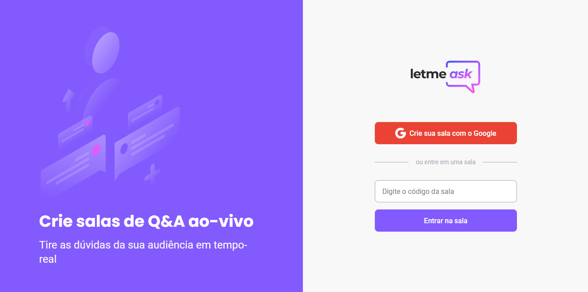
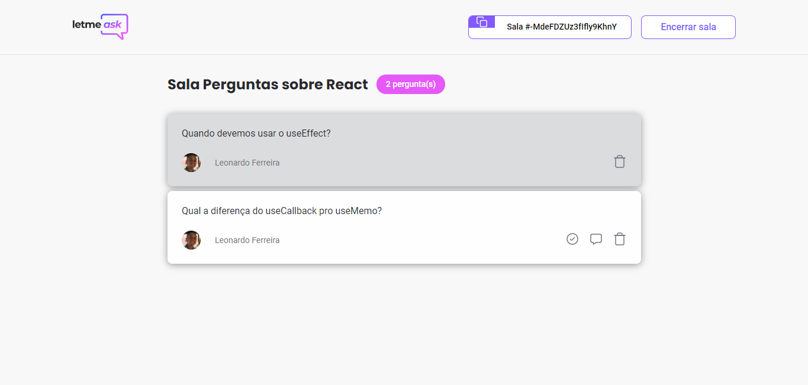
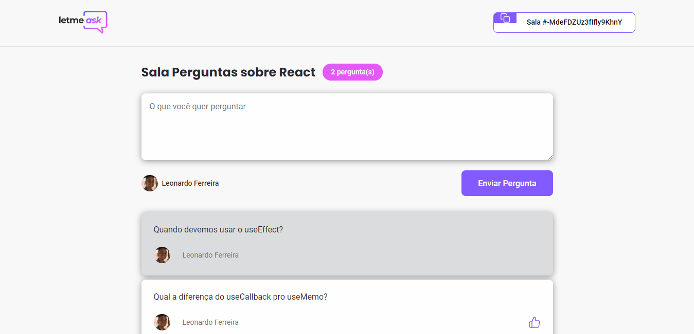
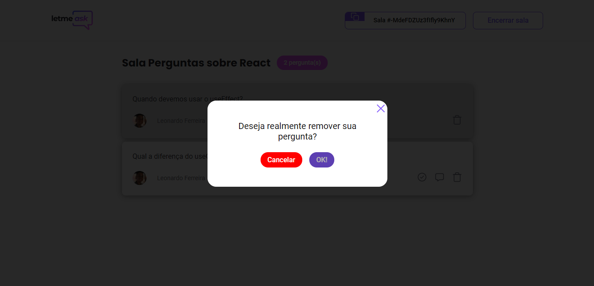

# <h1 align="center"> LET ME ASK

# Screenshots 📸

# HOME

# ADMIN ROUTE

# USER ROUTE

# MODAL

# Technologies ⚙️

-  React

-  React Router DOM

-  Firebase

-  Sass

-  Classnames

-  Editorconfig

-  Typescript

-  ESlint

# Get started 🔌

## install dependencies

`npm install or yarn`

## running the project

`npm start or yarn start`

# My feature 💡

In this feature i implement a modal to remove the questions
in the admin route to better UX (user experience).

# Medias 📲

-  [Facebook](https://www.facebook.com/ZinnLeo/)
-  [LinkedIN](https://www.linkedin.com/in/leonardo-ferreira-253a60173/)
-  [Instagram](https://www.instagram.com/zinnlua/)
